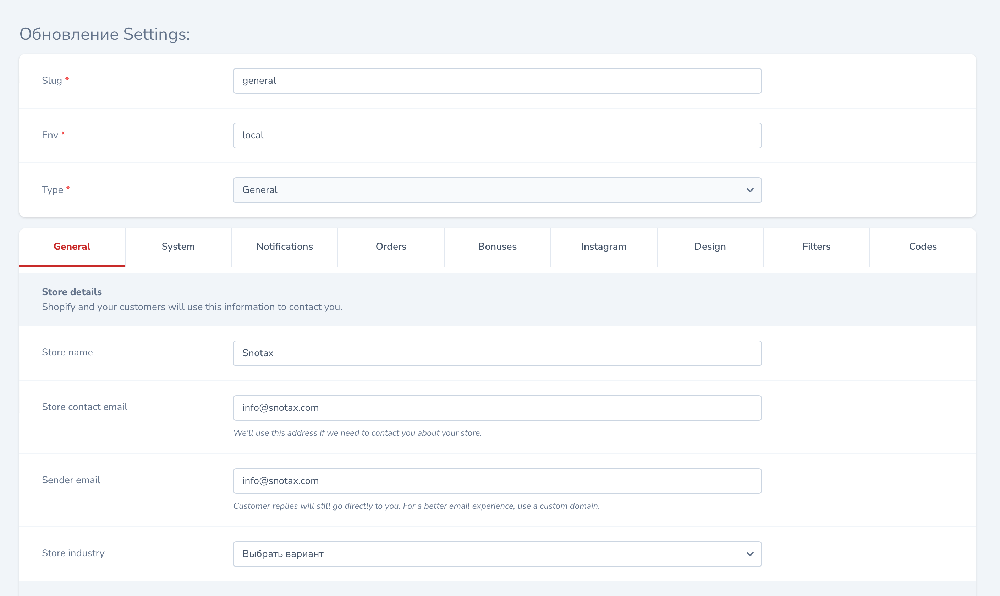
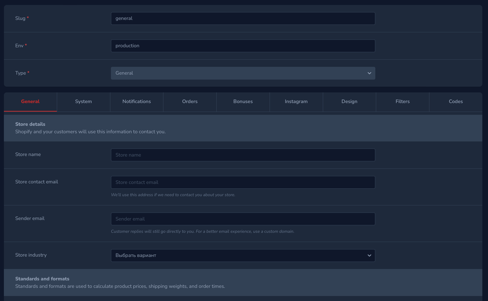

# Settings management Tool for Nova

[](https://packagist.org/packages/stepanenko3/nova-settings)
[](https://packagist.org/packages/stepanenko3/nova-settings)
[](https://packagist.org/packages/stepanenko3/nova-settings)

## Requirements

- `php: >=8.0`
- `laravel/nova: ^4.0`

## Features

- Using native Nova resources
- Fully responsive
- Dark mode support
- Support all packages. Like nova-tabs, activity-log, etc.
- Different settings depending on the current Env
- Separation of settings into different classes
- Customizable model and resource



## Installation

```bash
# Install the package
composer require stepanenko3/nova-settings
```

Publish the config file:

``` bash
php artisan vendor:publish --provider="Stepanenko3\NovaSettings\ToolServiceProvider" --tag="config"
```

Publish the migration file:

``` bash
php artisan vendor:publish --provider="Stepanenko3\NovaSettings\ToolServiceProvider" --tag="migrations"
```

And run `php artisan migrate`

Next up, you must register the tool with Nova. This is typically done in the `tools` method of the `NovaServiceProvider`.

```php
// in app/Providers/NovaServiceProvder.php

// ...

public function tools()
{
    return [
        // ...
        new \Stepanenko3\NovaSettings\NovaSettingsTool(),
    ];
}
```

Create your own configuration classes in app/Nova/Settings
```php
// in app/Nova/Settings/Demo.php

<?php

namespace App\Nova\Settings;

use Eminiarts\Tabs\Tab;
use Eminiarts\Tabs\Tabs;
use Laravel\Nova\Fields\Boolean;
use Stepanenko3\NovaSettings\Types\AbstractType;

class Demo extends AbstractType
{
    public function fields(): array
    {
        return [
            Boolean::make('Param 1', 'param_1'),
            Boolean::make('Param 2', 'param_2'),
            Boolean::make('Param 3', 'param_3'),

            new Tabs('Tabs 1', [
                new Tab('Tab 1', [
                    Boolean::make('Param 1', 'param_1'),
                    Boolean::make('Param 2', 'param_2'),
                    Boolean::make('Param 3', 'param_3'),
                ]),
                new Tab('Tab 2', [
                    Boolean::make('Param 1', 'param_1'),
                    Boolean::make('Param 2', 'param_2'),
                    Boolean::make('Param 3', 'param_3'),
                ]),
                new Tab('Tab 3', [
                    Boolean::make('Param 1', 'param_1'),
                    Boolean::make('Param 2', 'param_2'),
                    Boolean::make('Param 3', 'param_3'),
                ]),
            ]),
        ];
    }
}
```

Delcare your settings class in `config/nova-settings.php`
``` php
<?php

return [
    'model' => \Stepanenko3\NovaSettings\Models\Settings::class,

    'resource' => \Stepanenko3\NovaSettings\Resources\Settings::class,

    'types' => [
        \App\Nova\Settings\Demo::class, // Add this line
    ],
];
```

## Usage

Click on the `"Settings"` menu item in your Nova app to see the tool.

Use helper function for access the settings
``` php
// settings(string|null $section, string|null $key = null, string|null $default = null, string|null $env = null)
settings('demo', 'key', 'defaultValue', config('app.env'))
```

## Configuration

All the configuration is managed from a single configuration file located in `config/nova-settings.php`

### Extends default model

Create your own model that will extends `\Stepanenko3\NovaSettings\Models\Settings`

```php
// in app/Models/Settings.php

<?php

namespace App\Models;

use Spatie\Activitylog\LogOptions;
use Spatie\Activitylog\Traits\LogsActivity;

class Settings extends \Stepanenko3\NovaSettings\Models\Settings
{
    use LogsActivity;

    public function getActivitylogOptions(): LogOptions
    {
        return LogOptions::defaults()
            ->logFillable()
            ->logOnlyDirty();
    }
}
```

Declare your model `'model' => \App\Models\Settings::class,` in `config/nova-settings.php`

## Extends default Nova resource

Create your own resource that will extends `\Stepanenko3\NovaSettings\Resources\Settings`

``` php
// in app/Nova/Settings.php

<?php

namespace App\Nova;

use Illuminate\Http\Request;
use Laravel\Nova\Fields\HasMany;

class Settings extends \Stepanenko3\NovaSettings\Resources\Settings
{
    public function fields(Request $request)
    {
        return array_merge(parent::fields($request), [
            HasMany::make('Activities', 'activities', 'App\Nova\ActivityLog'),
        ]);
    }
}
```

Declare your resource `'resource' => \App\Nova\Settings::class,` in `config/nova-settings.php`

Don't forget to create `App\Nova\ActivityLog`

### Screenshots



## Credits

- [Artem Stepanenko](https://github.com/stepanenko3)

## Contributing

Thank you for considering contributing to this package! Please create a pull request with your contributions with detailed explanation of the changes you are proposing.

## License

This package is open-sourced software licensed under the [MIT license](LICENSE.md).
